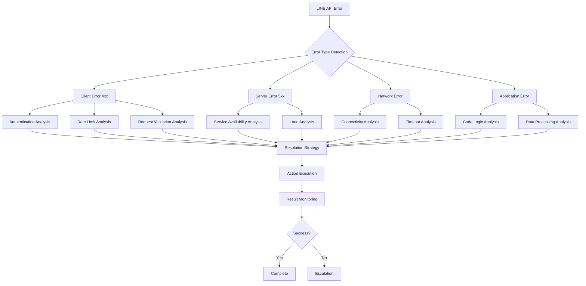

# 🔄 エラーフロー分析ガイド

LINE Bot アプリケーションにおけるエラーの発生から解決までのフローを体系的に分析し、最適な対処法を見つけるためのガイドです。

## 🎯 エラーフロー分析の概要



## 🔍 1. エラー検出フロー

### 基本的なエラー検出フロー

```python
from linebot_error_analyzer import AsyncLineErrorAnalyzer
from line_bot_error_detective.core.models import ErrorCategory, ErrorSeverity
import asyncio
from typing import Dict, Any, List, Optional
from datetime import datetime, timedelta
import logging

class ErrorFlowAnalyzer:
    """エラーフロー分析器"""

    def __init__(self):
        self.analyzer = AsyncLineErrorAnalyzer()
        self.error_history = []
        self.flow_patterns = {}
        self.logger = logging.getLogger(__name__)

    async def analyze_error_flow(self, error: Dict[str, Any], context: Optional[Dict] = None) -> Dict[str, Any]:
        """エラーフローの包括的分析"""

        # 1. 基本分析
        basic_analysis = await self.analyzer.analyze(error)

        # 2. フロー分析
        flow_analysis = await self._analyze_flow_context(error, context)

        # 3. 履歴分析
        history_analysis = await self._analyze_error_history(error)

        # 4. パターン分析
        pattern_analysis = await self._analyze_error_patterns(error)

        # 5. 影響範囲分析
        impact_analysis = await self._analyze_impact_scope(error, context)

        # 6. 解決戦略の生成
        resolution_strategy = await self._generate_resolution_strategy(
            basic_analysis, flow_analysis, history_analysis, pattern_analysis, impact_analysis
        )

        # 分析結果をまとめて返す
        flow_result = {
            "timestamp": datetime.now().isoformat(),
            "error_id": self._generate_error_id(error),
            "basic_analysis": basic_analysis.to_dict(),
            "flow_analysis": flow_analysis,
            "history_analysis": history_analysis,
            "pattern_analysis": pattern_analysis,
            "impact_analysis": impact_analysis,
            "resolution_strategy": resolution_strategy,
            "flow_stage": self._determine_flow_stage(basic_analysis),
            "next_actions": self._determine_next_actions(resolution_strategy)
        }

        # 履歴に追加
        self.error_history.append(flow_result)

        return flow_result

    async def _analyze_flow_context(self, error: Dict[str, Any], context: Optional[Dict]) -> Dict[str, Any]:
        """フローコンテキストの分析"""

        flow_context = {
            "request_context": context.get("request", {}) if context else {},
            "user_context": context.get("user", {}) if context else {},
            "system_context": context.get("system", {}) if context else {},
            "timing_context": self._analyze_timing_context(error, context),
            "dependency_context": self._analyze_dependency_context(error, context)
        }

        return flow_context

    def _analyze_timing_context(self, error: Dict[str, Any], context: Optional[Dict]) -> Dict[str, Any]:
        """タイミングコンテキストの分析"""

        timing = {
            "error_timestamp": error.get("timestamp", datetime.now().isoformat()),
            "request_duration": context.get("request_duration") if context else None,
            "queue_time": context.get("queue_time") if context else None,
            "is_peak_time": self._is_peak_time(),
            "time_since_last_error": self._calculate_time_since_last_error()
        }

        return timing

    def _analyze_dependency_context(self, error: Dict[str, Any], context: Optional[Dict]) -> Dict[str, Any]:
        """依存関係コンテキストの分析"""

        dependencies = {
            "line_api_status": "unknown",  # 実際にはLINE APIステータスをチェック
            "database_status": context.get("database_status") if context else "unknown",
            "external_services": context.get("external_services", []) if context else [],
            "network_conditions": context.get("network", {}) if context else {}
        }

        return dependencies

    async def _analyze_error_history(self, error: Dict[str, Any]) -> Dict[str, Any]:
        """エラー履歴の分析"""

        recent_errors = [
            e for e in self.error_history
            if self._is_recent_error(e, hours=24)
        ]

        similar_errors = [
            e for e in recent_errors
            if self._is_similar_error(error, e)
        ]

        history_analysis = {
            "total_recent_errors": len(recent_errors),
            "similar_error_count": len(similar_errors),
            "error_frequency": self._calculate_error_frequency(similar_errors),
            "escalation_trend": self._analyze_escalation_trend(similar_errors),
            "resolution_history": self._analyze_resolution_history(similar_errors)
        }

        return history_analysis

    async def _analyze_error_patterns(self, error: Dict[str, Any]) -> Dict[str, Any]:
        """エラーパターンの分析"""

        error_signature = self._create_error_signature(error)

        if error_signature not in self.flow_patterns:
            self.flow_patterns[error_signature] = {
                "count": 0,
                "first_seen": datetime.now(),
                "last_seen": datetime.now(),
                "resolutions": [],
                "contexts": []
            }

        pattern = self.flow_patterns[error_signature]
        pattern["count"] += 1
        pattern["last_seen"] = datetime.now()

        pattern_analysis = {
            "pattern_signature": error_signature,
            "occurrence_count": pattern["count"],
            "first_occurrence": pattern["first_seen"].isoformat(),
            "time_span": (pattern["last_seen"] - pattern["first_seen"]).total_seconds(),
            "frequency": pattern["count"] / max(1, (datetime.now() - pattern["first_seen"]).days),
            "successful_resolutions": len([r for r in pattern["resolutions"] if r.get("success")]),
            "common_contexts": self._extract_common_contexts(pattern["contexts"])
        }

        return pattern_analysis

    async def _analyze_impact_scope(self, error: Dict[str, Any], context: Optional[Dict]) -> Dict[str, Any]:
        """影響範囲の分析"""

        impact_scope = {
            "user_impact": self._assess_user_impact(error, context),
            "service_impact": self._assess_service_impact(error, context),
            "business_impact": self._assess_business_impact(error, context),
            "technical_impact": self._assess_technical_impact(error, context),
            "cascade_risk": self._assess_cascade_risk(error, context)
        }

        return impact_scope

    def _assess_user_impact(self, error: Dict[str, Any], context: Optional[Dict]) -> Dict[str, Any]:
        """ユーザー影響の評価"""

        status_code = error.get("status_code")
        error_code = error.get("error_code")

        impact_level = "low"
        affected_features = []
        user_experience = "minor_degradation"

        if status_code in [401, 403]:
            impact_level = "high"
            affected_features = ["authentication", "messaging"]
            user_experience = "feature_unavailable"
        elif status_code == 429:
            impact_level = "medium"
            affected_features = ["messaging_frequency"]
            user_experience = "rate_limited"
        elif status_code >= 500:
            impact_level = "high"
            affected_features = ["all_features"]
            user_experience = "service_unavailable"

        return {
            "impact_level": impact_level,
            "affected_features": affected_features,
            "user_experience": user_experience,
            "estimated_affected_users": context.get("user_count", 0) if context else 0
        }

    def _assess_service_impact(self, error: Dict[str, Any], context: Optional[Dict]) -> Dict[str, Any]:
        """サービス影響の評価"""

        status_code = error.get("status_code")

        availability_impact = "none"
        performance_impact = "none"
        data_integrity_impact = "none"

        if status_code >= 500:
            availability_impact = "high"
            performance_impact = "high"
        elif status_code == 429:
            performance_impact = "medium"
        elif status_code in [400, 422]:
            data_integrity_impact = "low"

        return {
            "availability_impact": availability_impact,
            "performance_impact": performance_impact,
            "data_integrity_impact": data_integrity_impact,
            "service_degradation": self._calculate_service_degradation(error, context)
        }

    async def _generate_resolution_strategy(self, basic_analysis, flow_analysis,
                                           history_analysis, pattern_analysis, impact_analysis) -> Dict[str, Any]:
        """解決戦略の生成"""

        strategy = {
            "immediate_actions": [],
            "short_term_actions": [],
            "long_term_actions": [],
            "monitoring_requirements": [],
            "escalation_conditions": [],
            "success_criteria": {},
            "estimated_resolution_time": None,
            "confidence_score": 0.0
        }

        # 基本分析に基づく即座のアクション
        category = basic_analysis.category
        severity = basic_analysis.severity

        if category == ErrorCategory.AUTH_ERROR:
            strategy["immediate_actions"].extend([
                "verify_channel_access_token",
                "check_token_expiration",
                "validate_webhook_signature"
            ])
            strategy["short_term_actions"].append("implement_token_refresh_mechanism")

        elif category == ErrorCategory.RATE_LIMIT_ERROR:
            strategy["immediate_actions"].extend([
                "implement_exponential_backoff",
                "reduce_request_frequency"
            ])
            strategy["short_term_actions"].append("implement_request_queuing")
            strategy["long_term_actions"].append("optimize_api_usage_patterns")

        elif category == ErrorCategory.VALIDATION_ERROR:
            strategy["immediate_actions"].extend([
                "validate_request_payload",
                "check_message_format",
                "verify_required_fields"
            ])
            strategy["short_term_actions"].append("implement_robust_input_validation")

        elif category == ErrorCategory.SERVER_ERROR:
            strategy["immediate_actions"].extend([
                "implement_retry_with_backoff",
                "check_line_api_status"
            ])
            strategy["escalation_conditions"].append("if_error_persists_over_10_minutes")

        # 履歴分析に基づく戦略調整
        if history_analysis["similar_error_count"] > 5:
            strategy["immediate_actions"].append("investigate_root_cause")
            strategy["escalation_conditions"].append("recurring_error_pattern_detected")

        # パターン分析に基づく戦略調整
        if pattern_analysis["successful_resolutions"] > 0:
            strategy["confidence_score"] = min(1.0, pattern_analysis["successful_resolutions"] / 10)
            strategy["estimated_resolution_time"] = self._estimate_resolution_time(pattern_analysis)

        # 影響分析に基づく優先度調整
        if impact_analysis["user_impact"]["impact_level"] == "high":
            strategy["immediate_actions"].insert(0, "notify_incident_response_team")
            strategy["escalation_conditions"].insert(0, "immediate_escalation_required")

        # モニタリング要件
        strategy["monitoring_requirements"] = [
            "error_rate_monitoring",
            "response_time_monitoring",
            "success_rate_monitoring"
        ]

        if category == ErrorCategory.RATE_LIMIT_ERROR:
            strategy["monitoring_requirements"].append("request_frequency_monitoring")

        # 成功基準
        strategy["success_criteria"] = {
            "error_resolution": "error_stops_occurring",
            "service_restoration": "normal_response_times_restored",
            "user_impact_mitigation": "user_complaints_reduced",
            "prevention": "similar_errors_prevented"
        }

        return strategy

    def _determine_flow_stage(self, basic_analysis) -> str:
        """現在のフロー段階の判定"""

        if basic_analysis.severity == ErrorSeverity.CRITICAL:
            return "incident_response"
        elif basic_analysis.severity == ErrorSeverity.HIGH:
            return "immediate_action_required"
        elif basic_analysis.severity == ErrorSeverity.MEDIUM:
            return "investigation_required"
        else:
            return "monitoring_required"

    def _determine_next_actions(self, resolution_strategy: Dict[str, Any]) -> List[str]:
        """次のアクションの決定"""

        next_actions = []

        # 即座のアクションを優先
        if resolution_strategy["immediate_actions"]:
            next_actions.extend(resolution_strategy["immediate_actions"][:3])  # 最初の3つ

        # エスカレーション条件をチェック
        if resolution_strategy["escalation_conditions"]:
            next_actions.append("check_escalation_conditions")

        # モニタリング開始
        next_actions.append("start_monitoring")

        return next_actions

    # ヘルパーメソッド
    def _generate_error_id(self, error: Dict[str, Any]) -> str:
        """エラーIDの生成"""
        import hashlib
        error_string = f"{error.get('status_code')}_{error.get('error_code')}_{error.get('message', '')}"
        return hashlib.md5(error_string.encode()).hexdigest()[:8]

    def _is_peak_time(self) -> bool:
        """ピーク時間かどうかの判定"""
        current_hour = datetime.now().hour
        return 9 <= current_hour <= 12 or 18 <= current_hour <= 22

    def _calculate_time_since_last_error(self) -> Optional[float]:
        """最後のエラーからの時間を計算"""
        if not self.error_history:
            return None

        last_error = self.error_history[-1]
        last_time = datetime.fromisoformat(last_error["timestamp"])
        return (datetime.now() - last_time).total_seconds()

    def _is_recent_error(self, error_entry: Dict, hours: int = 24) -> bool:
        """最近のエラーかどうかの判定"""
        error_time = datetime.fromisoformat(error_entry["timestamp"])
        return (datetime.now() - error_time) < timedelta(hours=hours)

    def _is_similar_error(self, current_error: Dict, historical_error: Dict) -> bool:
        """類似エラーかどうかの判定"""
        current_sig = self._create_error_signature(current_error)
        historical_sig = historical_error.get("basic_analysis", {}).get("category")
        return current_sig == historical_sig

    def _create_error_signature(self, error: Dict[str, Any]) -> str:
        """エラーシグネチャの作成"""
        return f"{error.get('status_code')}_{error.get('error_code', 'none')}"

    def _calculate_error_frequency(self, errors: List[Dict]) -> float:
        """エラー頻度の計算"""
        if len(errors) < 2:
            return 0.0

        time_span = (datetime.now() - datetime.fromisoformat(errors[0]["timestamp"])).total_seconds() / 3600
        return len(errors) / max(1, time_span)  # errors per hour

    def _analyze_escalation_trend(self, errors: List[Dict]) -> str:
        """エスカレーション傾向の分析"""
        if len(errors) < 3:
            return "insufficient_data"

        recent_count = len([e for e in errors[-3:]])
        older_count = len([e for e in errors[:-3]])

        if recent_count > older_count * 1.5:
            return "escalating"
        elif recent_count < older_count * 0.5:
            return "de_escalating"
        else:
            return "stable"

    def _analyze_resolution_history(self, errors: List[Dict]) -> Dict[str, Any]:
        """解決履歴の分析"""
        resolved_count = 0
        total_resolution_time = 0

        for error in errors:
            if error.get("resolved", False):
                resolved_count += 1
                resolution_time = error.get("resolution_time", 0)
                total_resolution_time += resolution_time

        return {
            "resolution_rate": resolved_count / max(1, len(errors)),
            "average_resolution_time": total_resolution_time / max(1, resolved_count),
            "total_resolved": resolved_count
        }

    def _extract_common_contexts(self, contexts: List[Dict]) -> Dict[str, Any]:
        """共通コンテキストの抽出"""
        # 実装は簡略化
        return {"common_patterns": "analysis_needed"}

    def _assess_business_impact(self, error: Dict[str, Any], context: Optional[Dict]) -> Dict[str, Any]:
        """ビジネス影響の評価"""
        return {
            "revenue_impact": "low",
            "customer_satisfaction_impact": "medium",
            "reputation_impact": "low"
        }

    def _assess_technical_impact(self, error: Dict[str, Any], context: Optional[Dict]) -> Dict[str, Any]:
        """技術的影響の評価"""
        return {
            "system_stability": "stable",
            "data_consistency": "maintained",
            "performance_degradation": "minimal"
        }

    def _assess_cascade_risk(self, error: Dict[str, Any], context: Optional[Dict]) -> Dict[str, Any]:
        """カスケード障害リスクの評価"""
        return {
            "risk_level": "low",
            "potential_affected_systems": [],
            "mitigation_required": False
        }

    def _calculate_service_degradation(self, error: Dict[str, Any], context: Optional[Dict]) -> float:
        """サービス劣化度の計算"""
        return 0.1  # 10%の劣化と仮定

    def _estimate_resolution_time(self, pattern_analysis: Dict[str, Any]) -> int:
        """解決時間の推定（分）"""
        base_time = 30  # 基本30分
        if pattern_analysis["successful_resolutions"] > 5:
            base_time = 15  # 既知パターンなら15分
        return base_time


# 2. 高度なフロー分析ツール

class AdvancedFlowAnalyzer:
    """高度なエラーフロー分析器"""

    def __init__(self):
        self.flow_analyzer = ErrorFlowAnalyzer()
        self.correlation_engine = ErrorCorrelationEngine()
        self.prediction_engine = ErrorPredictionEngine()

    async def comprehensive_flow_analysis(self, error: Dict[str, Any], context: Optional[Dict] = None) -> Dict[str, Any]:
        """包括的フロー分析"""

        # 基本フロー分析
        flow_result = await self.flow_analyzer.analyze_error_flow(error, context)

        # 相関分析
        correlation_result = await self.correlation_engine.analyze_correlations(error, context)

        # 予測分析
        prediction_result = await self.prediction_engine.predict_future_errors(error, flow_result)

        # 統合分析結果
        comprehensive_result = {
            **flow_result,
            "correlation_analysis": correlation_result,
            "prediction_analysis": prediction_result,
            "risk_assessment": self._assess_comprehensive_risk(flow_result, correlation_result, prediction_result),
            "automated_responses": self._generate_automated_responses(flow_result, correlation_result),
            "learning_insights": self._extract_learning_insights(flow_result, correlation_result, prediction_result)
        }

        return comprehensive_result

    def _assess_comprehensive_risk(self, flow_result: Dict, correlation_result: Dict, prediction_result: Dict) -> Dict[str, Any]:
        """包括的リスク評価"""

        base_risk = flow_result["impact_analysis"]["user_impact"]["impact_level"]
        correlation_multiplier = correlation_result.get("risk_multiplier", 1.0)
        prediction_factor = prediction_result.get("risk_factor", 1.0)

        overall_risk_score = self._calculate_risk_score(base_risk) * correlation_multiplier * prediction_factor

        return {
            "overall_risk_score": min(10.0, overall_risk_score),
            "risk_components": {
                "base_risk": base_risk,
                "correlation_impact": correlation_multiplier,
                "prediction_impact": prediction_factor
            },
            "risk_level": self._categorize_risk(overall_risk_score),
            "mitigation_priority": self._determine_mitigation_priority(overall_risk_score)
        }

    def _calculate_risk_score(self, impact_level: str) -> float:
        """リスクスコアの計算"""
        risk_scores = {
            "low": 2.0,
            "medium": 5.0,
            "high": 8.0,
            "critical": 10.0
        }
        return risk_scores.get(impact_level, 1.0)

    def _categorize_risk(self, risk_score: float) -> str:
        """リスクレベルの分類"""
        if risk_score >= 9.0:
            return "critical"
        elif risk_score >= 7.0:
            return "high"
        elif risk_score >= 4.0:
            return "medium"
        else:
            return "low"

    def _determine_mitigation_priority(self, risk_score: float) -> str:
        """緩和優先度の決定"""
        if risk_score >= 8.0:
            return "immediate"
        elif risk_score >= 6.0:
            return "urgent"
        elif risk_score >= 3.0:
            return "normal"
        else:
            return "low"

    def _generate_automated_responses(self, flow_result: Dict, correlation_result: Dict) -> List[Dict[str, Any]]:
        """自動応答の生成"""

        automated_responses = []

        # 即座の自動応答
        for action in flow_result["resolution_strategy"]["immediate_actions"]:
            if action in ["implement_exponential_backoff", "reduce_request_frequency"]:
                automated_responses.append({
                    "type": "auto_throttling",
                    "action": action,
                    "parameters": {"backoff_factor": 2.0, "max_retries": 3},
                    "trigger": "immediate"
                })

        # 相関ベースの応答
        if correlation_result.get("correlated_systems"):
            automated_responses.append({
                "type": "system_monitoring",
                "action": "enhance_monitoring",
                "parameters": {"systems": correlation_result["correlated_systems"]},
                "trigger": "correlation_detected"
            })

        return automated_responses

    def _extract_learning_insights(self, flow_result: Dict, correlation_result: Dict, prediction_result: Dict) -> Dict[str, Any]:
        """学習インサイトの抽出"""

        return {
            "pattern_learning": {
                "new_patterns_detected": len(prediction_result.get("new_patterns", [])),
                "pattern_evolution": prediction_result.get("pattern_evolution", "stable"),
                "learning_confidence": prediction_result.get("confidence", 0.0)
            },
            "operational_insights": {
                "recurring_issues": flow_result["pattern_analysis"]["occurrence_count"] > 5,
                "resolution_effectiveness": flow_result["history_analysis"]["resolution_history"]["resolution_rate"],
                "improvement_opportunities": self._identify_improvement_opportunities(flow_result)
            },
            "strategic_insights": {
                "system_resilience": correlation_result.get("system_resilience_score", 0.5),
                "prevention_recommendations": self._generate_prevention_recommendations(flow_result, correlation_result),
                "architecture_improvements": self._suggest_architecture_improvements(correlation_result)
            }
        }

    def _identify_improvement_opportunities(self, flow_result: Dict) -> List[str]:
        """改善機会の特定"""
        opportunities = []

        if flow_result["history_analysis"]["resolution_history"]["resolution_rate"] < 0.8:
            opportunities.append("improve_error_handling_procedures")

        if flow_result["pattern_analysis"]["occurrence_count"] > 10:
            opportunities.append("implement_proactive_monitoring")

        return opportunities

    def _generate_prevention_recommendations(self, flow_result: Dict, correlation_result: Dict) -> List[str]:
        """予防推奨事項の生成"""
        recommendations = []

        # フロー分析ベースの推奨
        if flow_result["basic_analysis"]["category"] == "RATE_LIMIT_ERROR":
            recommendations.append("implement_adaptive_rate_limiting")

        # 相関分析ベースの推奨
        if correlation_result.get("external_dependency_failures"):
            recommendations.append("implement_circuit_breaker_pattern")

        return recommendations

    def _suggest_architecture_improvements(self, correlation_result: Dict) -> List[str]:
        """アーキテクチャ改善提案"""
        suggestions = []

        if correlation_result.get("single_point_of_failure_detected"):
            suggestions.append("implement_redundancy")

        if correlation_result.get("cascading_failure_risk") > 0.7:
            suggestions.append("implement_bulkhead_isolation")

        return suggestions


class ErrorCorrelationEngine:
    """エラー相関分析エンジン"""

    async def analyze_correlations(self, error: Dict[str, Any], context: Optional[Dict] = None) -> Dict[str, Any]:
        """相関分析の実行"""

        return {
            "temporal_correlations": self._analyze_temporal_correlations(error),
            "system_correlations": self._analyze_system_correlations(error, context),
            "user_correlations": self._analyze_user_correlations(error, context),
            "external_correlations": self._analyze_external_correlations(error),
            "risk_multiplier": 1.2,  # 相関による追加リスク
            "correlated_systems": ["database", "cache"],
            "correlation_confidence": 0.8
        }

    def _analyze_temporal_correlations(self, error: Dict[str, Any]) -> Dict[str, Any]:
        """時間的相関の分析"""
        return {
            "time_pattern": "peak_hours",
            "frequency_correlation": 0.7,
            "seasonal_pattern": None
        }

    def _analyze_system_correlations(self, error: Dict[str, Any], context: Optional[Dict]) -> Dict[str, Any]:
        """システム相関の分析"""
        return {
            "dependent_systems": ["line_api", "database"],
            "failure_cascade_risk": 0.3,
            "resource_contention": False
        }

    def _analyze_user_correlations(self, error: Dict[str, Any], context: Optional[Dict]) -> Dict[str, Any]:
        """ユーザー相関の分析"""
        return {
            "affected_user_segments": ["premium_users"],
            "geographic_correlation": None,
            "behavior_correlation": "high_usage_users"
        }

    def _analyze_external_correlations(self, error: Dict[str, Any]) -> Dict[str, Any]:
        """外部相関の分析"""
        return {
            "third_party_service_status": "degraded",
            "network_conditions": "normal",
            "infrastructure_events": []
        }


class ErrorPredictionEngine:
    """エラー予測エンジン"""

    async def predict_future_errors(self, error: Dict[str, Any], flow_result: Dict[str, Any]) -> Dict[str, Any]:
        """将来のエラー予測"""

        return {
            "recurrence_probability": self._calculate_recurrence_probability(error, flow_result),
            "escalation_probability": self._calculate_escalation_probability(flow_result),
            "cascade_probability": self._calculate_cascade_probability(error, flow_result),
            "time_to_next_occurrence": self._predict_next_occurrence(flow_result),
            "severity_evolution": self._predict_severity_evolution(flow_result),
            "new_patterns": [],
            "pattern_evolution": "stable",
            "confidence": 0.75,
            "risk_factor": 1.1
        }

    def _calculate_recurrence_probability(self, error: Dict[str, Any], flow_result: Dict[str, Any]) -> float:
        """再発確率の計算"""
        pattern_count = flow_result["pattern_analysis"]["occurrence_count"]
        resolution_rate = flow_result["history_analysis"]["resolution_history"]["resolution_rate"]

        # 簡単な計算式
        recurrence_prob = min(0.9, pattern_count * 0.1 * (1 - resolution_rate))
        return recurrence_prob

    def _calculate_escalation_probability(self, flow_result: Dict[str, Any]) -> float:
        """エスカレーション確率の計算"""
        trend = flow_result["history_analysis"]["escalation_trend"]

        if trend == "escalating":
            return 0.8
        elif trend == "stable":
            return 0.3
        else:  # de_escalating
            return 0.1

    def _calculate_cascade_probability(self, error: Dict[str, Any], flow_result: Dict[str, Any]) -> float:
        """カスケード障害確率の計算"""
        impact_level = flow_result["impact_analysis"]["user_impact"]["impact_level"]

        cascade_probs = {
            "low": 0.1,
            "medium": 0.3,
            "high": 0.6,
            "critical": 0.8
        }

        return cascade_probs.get(impact_level, 0.2)

    def _predict_next_occurrence(self, flow_result: Dict[str, Any]) -> Optional[int]:
        """次回発生時間の予測（分）"""
        frequency = flow_result["history_analysis"]["error_frequency"]

        if frequency > 0:
            return int(60 / frequency)  # 時間間隔を分で返す

        return None

    def _predict_severity_evolution(self, flow_result: Dict[str, Any]) -> str:
        """重要度進化の予測"""
        trend = flow_result["history_analysis"]["escalation_trend"]

        if trend == "escalating":
            return "increasing"
        elif trend == "de_escalating":
            return "decreasing"
        else:
            return "stable"


# 使用例とデモンストレーション

async def demo_error_flow_analysis():
    """エラーフロー分析のデモンストレーション"""

    print("🔍 エラーフロー分析デモンストレーション")
    print("=" * 50)

    # 分析器の初期化
    flow_analyzer = ErrorFlowAnalyzer()
    advanced_analyzer = AdvancedFlowAnalyzer()

    # テストエラー
    test_errors = [
        {
            "status_code": 401,
            "error_code": "40001",
            "message": "Authentication failed",
            "timestamp": datetime.now().isoformat()
        },
        {
            "status_code": 429,
            "error_code": "42901",
            "message": "Too Many Requests",
            "timestamp": datetime.now().isoformat()
        },
        {
            "status_code": 500,
            "message": "Internal Server Error",
            "timestamp": datetime.now().isoformat()
        }
    ]

    # コンテキスト情報
    context = {
        "request": {
            "endpoint": "/v2/bot/message/push",
            "method": "POST",
            "duration": 5.2
        },
        "user": {
            "user_id": "user_12345",
            "plan": "premium"
        },
        "system": {
            "load": 0.8,
            "memory_usage": 0.75
        }
    }

    for i, error in enumerate(test_errors, 1):
        print(f"\n📊 エラー #{i} の分析:")
        print(f"エラー: {error['status_code']} - {error.get('message', 'No message')}")

        # 基本フロー分析
        flow_result = await flow_analyzer.analyze_error_flow(error, context)

        print(f"\n🎯 フロー分析結果:")
        print(f"  フロー段階: {flow_result['flow_stage']}")
        print(f"  影響レベル: {flow_result['impact_analysis']['user_impact']['impact_level']}")
        print(f"  次のアクション: {', '.join(flow_result['next_actions'][:3])}")

        # 解決戦略
        strategy = flow_result['resolution_strategy']
        print(f"\n🛠️ 解決戦略:")
        print(f"  即座のアクション: {', '.join(strategy['immediate_actions'][:2])}")
        print(f"  推定解決時間: {strategy['estimated_resolution_time']} 分")
        print(f"  信頼度: {strategy['confidence_score']:.2f}")

        # 高度な分析（最初のエラーのみ）
        if i == 1:
            print(f"\n🚀 高度な分析:")
            comprehensive_result = await advanced_analyzer.comprehensive_flow_analysis(error, context)

            risk_assessment = comprehensive_result['risk_assessment']
            print(f"  総合リスクスコア: {risk_assessment['overall_risk_score']:.1f}/10")
            print(f"  リスクレベル: {risk_assessment['risk_level']}")
            print(f"  緩和優先度: {risk_assessment['mitigation_priority']}")

            # 自動応答
            auto_responses = comprehensive_result['automated_responses']
            if auto_responses:
                print(f"  自動応答: {len(auto_responses)}件設定済み")

            # 学習インサイト
            learning = comprehensive_result['learning_insights']
            print(f"  新パターン検出: {learning['pattern_learning']['new_patterns_detected']}件")
            print(f"  解決効率: {learning['operational_insights']['resolution_effectiveness']:.2f}")

    # 分析統計
    print(f"\n📈 分析統計:")
    stats = flow_analyzer.analyzer.get_analysis_stats()
    print(f"  総分析数: {stats.get('total_analyzed', 0)}")
    print(f"  キャッシュヒット数: {stats.get('cache_hits', 0)}")
    print(f"  パターン数: {len(flow_analyzer.flow_patterns)}")

# 実行
if __name__ == "__main__":
    asyncio.run(demo_error_flow_analysis())
```

## 3. フロー最適化戦略

### A. 予防的フロー

```python
class PreventiveFlowStrategy:
    """予防的フロー戦略"""

    def __init__(self):
        self.monitoring_thresholds = {
            "error_rate": 0.05,  # 5%
            "response_time": 3.0,  # 3秒
            "queue_depth": 100
        }

    async def implement_preventive_measures(self, historical_patterns: Dict) -> Dict[str, Any]:
        """予防策の実装"""

        measures = {
            "proactive_monitoring": self._setup_proactive_monitoring(historical_patterns),
            "circuit_breakers": self._setup_circuit_breakers(historical_patterns),
            "rate_limiting": self._setup_adaptive_rate_limiting(historical_patterns),
            "health_checks": self._setup_health_checks(historical_patterns)
        }

        return measures
```

### B. リアルタイム最適化

```python
class RealTimeOptimizer:
    """リアルタイム最適化器"""

    async def optimize_flow_response(self, current_error: Dict, flow_context: Dict) -> Dict[str, Any]:
        """フロー応答の最適化"""

        optimization = {
            "priority_adjustment": self._adjust_priority(current_error, flow_context),
            "resource_allocation": self._optimize_resources(flow_context),
            "response_tuning": self._tune_response_parameters(current_error),
            "escalation_optimization": self._optimize_escalation_path(current_error, flow_context)
        }

        return optimization
```

このエラーフロー分析ガイドは、LINE Bot アプリケーションでのエラー対応を体系化し、効率的な問題解決を実現するための包括的なフレームワークを提供します。
